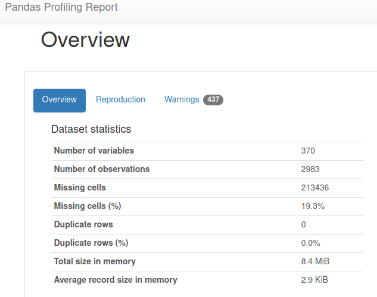
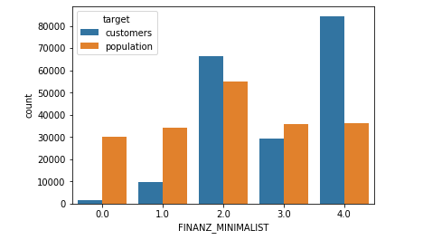

# Capstone Project: Project Report

## Description

This document is meant to outline the whole development of the capstone project for the Udacity's Nanodegree Machine Learning Engineer. Since the beginning, when defining the proposal, up to the end, when a classification model was submitted to Kaggle, and then some learnings and conclusions will be drawn.

It will be mainly composed of the five key points stated in the project's webpage which are gathered in the next section.

## Key points of the report

1. > You will first define the problem you want to solve and investigate potential solutions and performance metrics.

1. > Next, you will analyze the problem through visualizations and data exploration to have a better understanding of what algorithms and features are appropriate for solving it.

1. > You will then implement your algorithms and metrics of choice, documenting the preprocessing, refinement, and postprocessing steps along the way.

1. > Afterward, you will collect results about the performance of the models used, visualize significant quantities, and validate/justify these values.

1. > Finally, you will construct conclusions about your results, and discuss whether your implementation adequately solves the problem.

Throughout this document, each point will be addressed in its specific section.

### 1. Key point 1: _You will first define the problem you want to solve and investigate potential solutions and performance metrics._

This project is divided into 4 main stages:

* Part 0: Get to Know the Data
* Part 1: Customer Segmentation Report
* Part 2: Supervised Learning Model
* Part 3: Kaggle Competition

To address it, the first step was to write a project proposal where it was addressed the main concerns, such as ideas, metrics and so on. However, this was an estimation of what would be interesting to do and the ideas that could be suitable to test before a real and thorough analysis of the data is performed. We could say this was a dynamical guide to follow that would be adapted along with the development including modifications as long as new insights were gathered.

After that, the next stage is the so-called EDA (Exploratory Data Analysis) where the following 4 datasets are analyzed:

* **Udacity_AZDIAS_052018.csv** -> This dataset contains information about general population in Germany
* **Udacity_CUSTOMERS_052018.csv** -> This dataset could be considered as a subset of the previous dataset, but here it only includes information about those german people that are also customers of this company.
* **Udacity_MAILOUT_052018_TEST.csv** -> This dataset contains users that were targeted by a marketing campaign. It includes socio-demographic variables and different affinities. It also contains whether or not the campaign worked, e.g. the target value to predict. This is the training partition.
* **Udacity_MAILOUT_052018_TRAIN.csv** -> This dataset contains users that were targeted by a marketing campaign. It includes socio-demographic variables and different affinities. It also contains whether or not the campaign worked, e.g. the target value to predict. This is the test partition.

These analyses showed us that we may need to change some of the assumptions we had when we started to analyze the problem.

For the customer segmentation report, our target is to analyze the traits our customer have and how they differ from the general population. At this step, we have not a defined performance metric yet.

For the following stages, we will rely on standard and powerful supervised classification models and we will use ROC-AUC as the selected metric, as it was suggested in the Kaggle instructions.

### 2. Key point 2: _Next, you will analyze the problem through visualizations and data exploration to have a better understanding of what algorithms and features are appropriate for solving it._

What we do first is to perform an automated preliminary analysis using Pandas-Profiling. With this tool, we can quickly spot the main statistics of our dataset. In this case, we see in the following figure that for the "Udacity_CUSTOMERS_052018.csv" dataset we have about 3k observations which is very good but we also have more than 300 variables, which make the analysis much more difficult. Manually analyzing each variable is out of the scope for a dataset of this size. This is one of the first insights and a very important one, because we should change the strategy to deal with this size.

Figure. Pandas profiling overview.

The next we appreciate is the data quality dimension. In this case, the number of NULLs. In the following plot, we see that the average completeness of each variable is around 75%, which is not the best. We also see that some variables are even below 50%. This will guide the data quality strategy. If, for instance, we drop those variables with more than 20% of NULLs we will be deleting so much useful information. After some analysis, we decide the following: columns with more than 30% of NULLs will be discarded (5 columns only) the rest will be imputed using the mean for numerical variables and the most frequent category for categorical variables.

Figure. NULL distribution for all variables. The higher, the most complete.

What we do later is to analyze correlations between all variables. To do this we compute the so-called [Phi_K correlation](https://phik.readthedocs.io/en/latest/#), which allows us to analyze interactions between numerical variables and categorical variables all at the same time and with a nice heatmap.

Figure. Phi_K correlation

Here we see that there are a bunch of variables, either numerical or categorical, that are heavily dependant. We would be able to simplify the analysis removing them, or depending on the case, apply PCA to compress the information into a smaller space. We will see.

At this point, we start the manual analysis of the data, which will be explained in more detail in the following section.

It's important to remark that the findings for this dataset will be used to preprocess the following datasets, as all of them have a similar structure.

### 3. Key point 3: _You will then implement your algorithms and metrics of choice, documenting the preprocessing, refinement, and postprocessing steps along the way._

#### Preprocessing

After the automated inspection, is the time for a more manual stage: manual inspection and preprocessing. These steps are ordered in the following way:

Figure. Preprocessing steps.

Pandas and Pandas-profiling automatically try to infer the data type of each column, however, this is not always a good idea. As the document "DIAS Attributes - Values 2017.xlsx" shows there are some categorical variables which are expressed with numbers. These cases are very error-prone for automatic detection. Thus a manual inspection should be done. In this case, we use that document to set the data types using a custom python function.

Here, we also remove those columns that are not present in the document with the description. In total 98 non-listed columns, which is not a small number indeed. We do this because using variables which we don't know could harm the model and our results.

The same document that has the data types, also have the accepted values for each of the columns. Thus, it will be used to filter out those odd values and substitute them by NULLs.

As explained before, tackling with uninformed values, e.g. NULLs will be done in 2 steps: removing those columns with more NULLs than a specified threshold and imputing the rest of the columns using simple techniques such as using mean and most frequent categories.

In the following heatmap, we can see the Pearson correlation of the numerical columns.

Figure. Correlation heatmap of numerical variables.

We see here that those correlations previously spotted by the Phi_K correlation are not present anymore. This could be simply explained because in this step we already dropped many columns because of quality issues. What we see here is that we can safely keep all numerical variables.

After some analysis, we realized that removing outliers using a technique called Tukey's fence is not safe as it is more suitable for gaussian-distributed variables, but we previously decided to avoid inspecting variables one-by-one because of the big size of this dataset. Hence we decided to skip removing outliers to avoid making more harm than good.

Next, some preprocessing is performed in the categorical variables space: first, we remove those columns wich more than 80% of their values are constant, then we remove those with a very high cardinality, which could produce overfitting issues.

#### Customer report

For the customer report was suggested to follow a similar approach previously used in a different exercise. However, after analyzing the data we realize it was not feasible, as here we had only a few numerical variables and most of them were categorical. To be more specific, only 3.2% of the total columns (250) were numerical. If we use a K-means clustering we will be loosing so much information which could distort our findings and may produce the [simpson's paradox](https://en.wikipedia.org/wiki/Simpson%27s_paradox). Hence, we decided to go in a different way: use a supervised model to find if it's able to separate customers from the population in general. This way we can use interpretability techniques to find the main traits that our customers have which is very powerful to understand our business and how we should craft the following marketing campaigns. For this task, we downsample the population dataset so we have a comparable number of samples for both classes. Then we use the well-known XGBoost algorithm to train the model. For interpretability we use a simple yet powerful technique which is "feature importance" and it's intrinsic to tree-based model.

#### Classification model

In this case, we use a different dataset, the training one. The classification performed here it's a bit different: we already have the classes, which are the response of each person to the marketing campaign. As the gross of the targeted users didn't respond to the campaign, the problem is heavily unbalanced with less than 2% of users labelled as class 1 (good response to the campaign). To deal with this, we tuned the cost function using a parameter called _scale_pos_weight_ which gives more weight to misclassifications of the minority class. Also, to avoid overfitting we split the training set into training and validation to use the validation set while fitting the model. This way we can apply a regularization method called early-stopping.

#### Kaggle submission

When our previous model is already fitted, we use it to score the test partition  which has not a target column. Then we adapt the results to the format required to issue a submission to the Kaggle challenge.

## 4. Key point 4: _Afterward, you will collect results about the performance of the models used, visualize significant quantities, and validate/justify these values._

#### Customer report

With our approach, we obtain an accuracy score of 0.837

This is very good as the model is telling us that it is capable to separate people that it is already a customer from the total population in general. It means there are clear patterns that the customers present and we can use to target potential new customers.

Not having a perfect score is good in 2 ways: first, because the model is not overfitting the data and second, but the most important one, is that there are people from population dataset that are being misclassified as customers because they show similar patterns, hence are very likely to become the following customers. We should focus immediately on this subset of people to begin with marketing campaigns.

Using interpretability reveal this to us:

Figure. Feature importance for the customer report.

So now we have the most important traits to identify our customers.

If we analyze the distribution of categories for the feature with the highest predictive power which is 'FINANZ_MINIMALIST' we obtain the following:

Figure. Finanz minimalist categories distribution.

This is awesome. With this visualization, we see that, for instance, people who lie in category 0.0 of 'FINANZ_MINIMALIST' are not the best to be targeted in a new campaign, while those in the category 4.0 are a better option.

This is very powerful to segment the database, and it is especially useful for a case like this where we have a huge number of categorical features.

#### Classification model

Here the performance was not as good as before. In this case, we reach a ROC-AUC of 0.583 in the validation set. We changed the metric here as in the previous case the targets where balanced, however, it's not the same here. Thus is better to use a metric of this kind. This specific one was chosen because it's recommended for the Kaggle challenge.

#### Kaggle submission

For the private test set that Kaggle has, we scored a ROC-AUC of 0.393 which is a pretty result, but somehow an expected result taking into account the previous results in our validation set.

## 5. Key point 5: _Finally, you will construct conclusions about your results, and discuss whether your implementation adequately solves the problem._

We will divide our conclusion into two parts: one for the customer segmentation report and one for the classification model and Kaggle's submission.

#### Customer segmentation

Our main conclusions are that a different approach had to be developed compared to the proposal as the number of categorical variables are in a huge proportion. The classification model helped us to overcome this issue while achieving the same target: identify the main traits of our customers and how to use it to begin new marketing campaigns. A key part of this was the use of interpretability techniques and a heavy use of data visualization.

#### Classification model and Kaggle's submission

The results were not so good here. We can be positive that our model exceeds the cut-off point of the random baseline, which makes it useful for business purposes. However, a more powerful model (with better metrics) will be highly recommended. We ascribe these poor results to a couple of keys: the first one is the unbalancement of classes, which is very high. A hyperparameter tunning scheme with cross-validation may be of help. The second key point is related to the variables discarded. After reading other users' comments in Kaggle, I realized that some of the most powerful variables to predict the outcome of the marketing campaign were those that I dropped off because of not being documented. While I could have easily added them, I don't feel is a good idea. I will improve the metric, of course, but why? and how? If we don't understand a variable we can not be sure if that variable contains any kind of data leakage or if it's an overfitting cause, if the quality is good, etc. It could be dangerous. So I think that, to improve metrics, more work should be oriented into the quality of the dataset (both in its documentation and in the number of NULLs and those non-accepted values).
